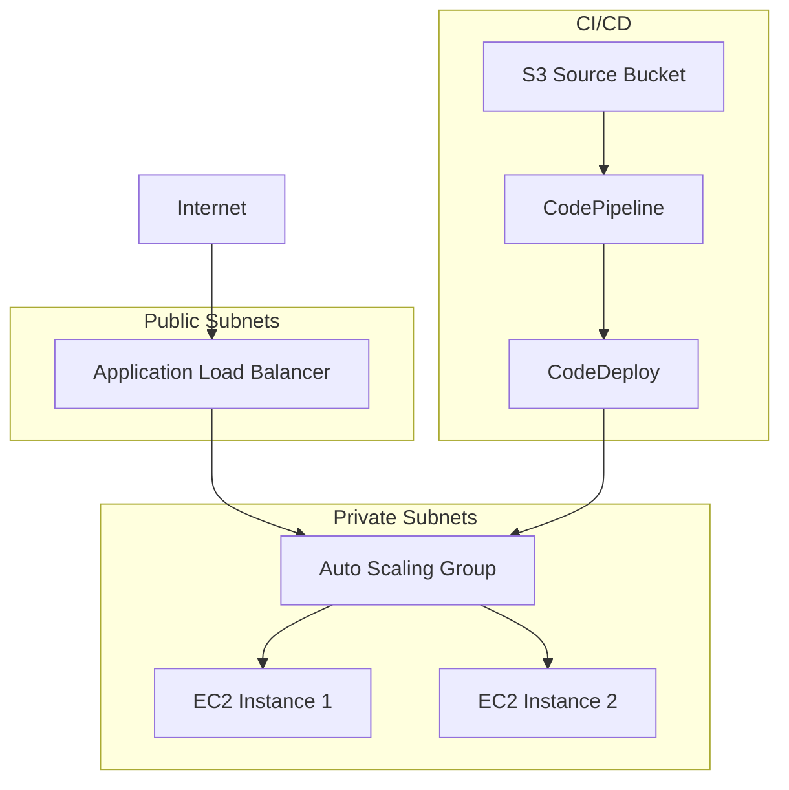

# 🚀 AWS EC2 Auto Scaling + CI/CD Infrastructure

[](https://www.terraform.io/)
[](https://aws.amazon.com/)
[](https://flask.palletsprojects.com/)

Dự án này triển khai một **infrastructure hoàn chỉnh** cho ứng dụng Flask Python trên AWS với khả năng **Auto Scaling** và **CI/CD pipeline** sử dụng Terraform modules.

## 📋 Tổng quan

Infrastructure này cung cấp:
- ✅ **High Availability**: Multi-AZ deployment với Auto Scaling Group
- ✅ **Load Balancing**: Application Load Balancer với SSL/TLS
- ✅ **CI/CD Pipeline**: Automated deployment với CodePipeline & CodeDeploy
- ✅ **Security**: Security Groups và IAM roles theo best practices
- ✅ **Monitoring**: CloudWatch alarms và health checks
- ✅ **Scalability**: Terraform modules có thể tái sử dụng

## 🏗️ Kiến trúc hệ thống



## 📁 Cấu trúc dự án

```
ec2-asg-cicd/
├── envs/                           # Environment configurations
│   └── dev/
│       └── ap-northeast-1/
│           ├── _datas.tf          # Data sources
│           ├── _locals.tf         # Local values
│           ├── _outputs.tf        # Output values
│           ├── _providers.tf      # Provider configurations
│           ├── acm.tf             # SSL certificate
│           ├── alb.tf             # Application Load Balancer
│           ├── asg.tf             # Auto Scaling Group
│           ├── codedeploy.tf      # CodeDeploy configuration
│           ├── codepipeline.tf    # CI/CD pipeline
│           ├── iam.tf             # IAM roles and policies
│           ├── s3.tf              # S3 buckets
│           ├── security_groups.tf # Security groups
│           ├── variables.tf       # Variable definitions
│           └── terraform.tfvars   # Variable values
├── modules/                        # Reusable Terraform modules
│   ├── aws-acm/                   # SSL certificate module
│   ├── aws-alb/                   # Load balancer module
│   ├── aws-asg/                   # Auto scaling module
│   ├── aws-codedeploy/            # Deployment module
│   ├── aws-codepipeline/          # Pipeline module
│   ├── aws-iam/                   # IAM module
│   ├── aws-s3/                    # Storage module
│   └── aws-security-groups/       # Security module
├── flask-deployment/               # Flask application source code
│   ├── README.md                  # Application deployment guide
│   ├── appspec.yml                # CodeDeploy specification
│   ├── app.py                     # Flask application
│   ├── requirements.txt           # Python dependencies
│   ├── scripts/                   # Deployment scripts
│   ├── templates/                 # HTML templates
│   ├── static/                    # CSS, JS, images
│   └── tests/                     # Unit tests
├── .terraform-version              # Terraform version lock
├── .gitignore                      # Git ignore rules
└── README.md                       # Documentation
```

## 🛠️ Các thành phần infrastructure

### 🖥️ Compute & Networking
| Component | Resource Name | Mô tả |
|-----------|---------------|-------|
| **Auto Scaling Group** | `will-stag-apn1-flask-python-asg` | EC2 instances (t3.micro) trong private subnets với CodeDeploy agent |
| **Load Balancer** | `will-stag-apn1-flask-python-alb` | Internet-facing ALB với SSL certificate và HTTPS redirect |
| **Security Groups** | `flask-python-alb-sg`, `flask-python-ec2-sg` | Network security cho ALB (80,443) và EC2 (5000) |

### 🚀 CI/CD Pipeline
| Component | Resource Name | Mô tả |
|-----------|---------------|-------|
| **CodeDeploy** | `will-stag-apn1-flask-python` | In-place deployment với ASG integration |
| **CodePipeline** | `will-stag-apn1-flask-python` | S3 source → CodeDeploy với auto-trigger |
| **S3 Buckets** | `flask-python-s3`, `codepipeline-artifacts` | Source code storage và pipeline artifacts |

### 🔐 Security & Monitoring
| Component | Mô tả |
|-----------|-------|
| **IAM Roles** | EC2 Instance Role, CodeDeploy Service Role, CodePipeline Role, CloudWatch Events Role |
| **SSL Certificate** | ACM certificate cho domain `alb-external.eragon123app.com` |
| **CloudWatch** | Auto Scaling Policies và health check alarms |

## 📦 Terraform Modules

### 🔧 Module Overview

| Module | Chức năng | Key Features |
|--------|-----------|--------------|
| **aws-acm** | SSL Certificate management | Certificate validation, domain validation |
| **aws-alb** | Application Load Balancer | Target groups, health checks, HTTPS listeners |
| **aws-asg** | Auto Scaling Group | Launch templates, scaling policies, user data |
| **aws-codedeploy** | Deployment automation | In-place deployment, rollback configuration |
| **aws-codepipeline** | CI/CD pipeline | S3 source, automated triggers, deployment stages |
| **aws-iam** | Identity & Access Management | Service roles, instance profiles, policies |
| **aws-s3** | Object storage | Versioning, encryption, lifecycle policies |
| **aws-security-groups** | Network security | Ingress/egress rules, least privilege access |

### 🎯 Module Benefits

- ✅ **Reusability**: Sử dụng lại cho multiple environments
- ✅ **Maintainability**: Centralized updates và bug fixes
- ✅ **Testing**: Isolated testing cho từng component
- ✅ **Scalability**: Easy scaling across regions/environments
- ✅ **Best Practices**: Follows Terraform và AWS best practices

## ✅ Prerequisites

### 🏗️ Infrastructure Requirements

| Requirement | Resource | Status |
|-------------|----------|--------|
| **VPC & Subnets** | Private: `will-stag-apn1-private-sn-01/02`<br>Public: `will-stag-apn1-public-sn-01/02` | Must exist |
| **SSL Certificate** | `alb-external.eragon123app.com` | Must be validated in ACM |
| **NAT Gateway** | For private subnet internet access | Required |
| **Domain** | DNS pointing to ALB | Optional for testing |

### 🛠️ Tools & Versions

```bash
# Required tools
terraform --version  # v1.9.2 (managed by tfenv)
aws --version        # AWS CLI v2.x
```

### 🔑 AWS Permissions

Đảm bảo AWS credentials có đủ permissions cho:
- EC2, ALB, ASG
- CodeDeploy, CodePipeline  
- IAM, S3, CloudWatch
- ACM, Route53 (if using custom domain)

## 🚀 Quick Start

### Step 1: Setup Terraform
```bash
# Install và configure Terraform version
tfenv install 1.9.2
tfenv use 1.9.2
terraform --version
```

### Step 2: Configure Environment
```bash
# Navigate to environment
cd envs/dev/ap-northeast-1

# Setup variables (customize terraform.tfvars)
cp terraform.tfvars.example terraform.tfvars
vim terraform.tfvars
```

### Step 3: Deploy Infrastructure
```bash
# Initialize Terraform
terraform init

# Review deployment plan
terraform plan

# Deploy infrastructure
terraform apply
```

### Step 4: Verify Deployment
```bash
# Check ALB endpoint
aws elbv2 describe-load-balancers --names will-stag-apn1-flask-python-alb

# Check Auto Scaling Group
aws autoscaling describe-auto-scaling-groups --auto-scaling-group-names will-stag-apn1-flask-python-asg

# Check CodePipeline status
aws codepipeline get-pipeline-state --name will-stag-apn1-flask-python
```

## 📱 Application Deployment

### 📦 Source Code Structure

Tạo application package với structure sau:

```
flask-app/
├── appspec.yml              # CodeDeploy specification
├── app.py                   # Flask application
├── requirements.txt         # Python dependencies
└── scripts/                 # Deployment scripts
    ├── install_dependencies.sh
    ├── start_server.sh
    └── stop_application.sh
```

### 📝 Configuration Files

<details>
<summary><strong>appspec.yml</strong> - CodeDeploy Configuration</summary>

```yaml
version: 0.0
os: linux
files:
  - source: /
    destination: /var/www/flask-app
hooks:
  BeforeInstall:
    - location: scripts/install_dependencies.sh
      timeout: 300
      runas: root
  ApplicationStart:
    - location: scripts/start_server.sh
      timeout: 300
      runas: root
  ApplicationStop:
    - location: scripts/stop_application.sh
      timeout: 300
      runas: root
```
</details>

<details>
<summary><strong>app.py</strong> - Flask Application</summary>

```python
from flask import Flask, jsonify
import os
import socket

app = Flask(__name__)

@app.route('/')
def hello():
    hostname = socket.gethostname()
    return f'''
    <h1>🚀 Flask App on AWS!</h1>
    <p><strong>Hostname:</strong> {hostname}</p>
    <p><strong>Environment:</strong> {os.environ.get('ENV', 'development')}</p>
    <p><strong>Version:</strong> 1.0.0</p>
    '''

@app.route('/health')
def health():
    return jsonify({
        'status': 'healthy',
        'hostname': socket.gethostname(),
        'environment': os.environ.get('ENV', 'development')
    })

@app.route('/api/info')
def info():
    return jsonify({
        'app': 'flask-python-aws',
        'version': '1.0.0',
        'hostname': socket.gethostname(),
        'environment': os.environ.get('ENV', 'development')
    })

if __name__ == '__main__':
    app.run(host='0.0.0.0', port=5000, debug=False)
```
</details>

<details>
<summary><strong>requirements.txt</strong> - Dependencies</summary>

```txt
Flask==2.3.3
gunicorn==21.2.0
```
</details>

<details>
<summary><strong>scripts/install_dependencies.sh</strong> - Install Script</summary>

```bash
#!/bin/bash
set -e

echo "Installing Python dependencies..."
cd /var/www/flask-app

# Create virtual environment if not exists
if [ ! -d "venv" ]; then
    python3 -m venv venv
fi

# Activate virtual environment and install dependencies
source venv/bin/activate
pip install --upgrade pip
pip install -r requirements.txt

echo "Dependencies installed successfully!"
```
</details>

<details>
<summary><strong>scripts/start_server.sh</strong> - Start Script</summary>

```bash
#!/bin/bash
set -e

echo "Starting Flask application..."
cd /var/www/flask-app

# Activate virtual environment
source venv/bin/activate

# Start application with gunicorn
nohup gunicorn --bind 0.0.0.0:5000 --workers 2 --timeout 60 app:app > /var/log/flask-app.log 2>&1 &

echo "Flask application started successfully!"
```
</details>

<details>
<summary><strong>scripts/stop_application.sh</strong> - Stop Script</summary>

```bash
#!/bin/bash

echo "Stopping Flask application..."

# Kill any running Flask/gunicorn processes
pkill -f "gunicorn.*app:app" || true
pkill -f "python.*app.py" || true

echo "Flask application stopped successfully!"
```
</details>

### 🚀 Deploy Application

**Đơn giản chỉ cần 2 bước:**

```bash
# 1. Zip thư mục flask-deployment
zip -r flask-deployment.zip flask-deployment/

# 2. Upload lên S3 (triggers CodePipeline tự động)
aws s3 cp flask-deployment.zip s3://will-stag-apn1-flask-python-s3/flask-deployment.zip
```

**Monitor deployment:**
```bash
# Theo dõi CodePipeline status
aws codepipeline get-pipeline-state --name will-stag-apn1-flask-python

# Theo dõi CodeDeploy progress
aws deploy list-deployments --application-name will-stag-apn1-flask-python
```

> 📖 **Detailed deployment guide**: Xem [flask-deployment/README.md](flask-deployment/README.md) để biết chi tiết về cấu trúc application và deployment process.

### 🔍 Test Application

```bash
# Get ALB DNS name
ALB_DNS=$(aws elbv2 describe-load-balancers \
  --names will-stag-apn1-flask-python-alb \
  --query 'LoadBalancers[0].DNSName' \
  --output text)

# Test endpoints
curl -k https://$ALB_DNS/                # Main page
curl -k https://$ALB_DNS/health          # Health check
curl -k https://$ALB_DNS/api/info        # API info
```

## 📂 Version Control & Git Best Practices

### 🚫 Files to Never Commit

Dự án đã được cấu hình với `.gitignore` để tự động loại bỏ:

```bash
# Terraform sensitive files
*.tfstate                    # Contains resource IDs, sensitive data
*.tfstate.backup            # Backup of state file
.terraform/                 # Provider binaries và cached modules
.terraform.lock.hcl         # Provider version locks (optional to commit)
*.tfvars                    # Contains sensitive variables

# AWS credentials & keys
.aws/
*.pem
*.ppk
aws_credentials

# Environment files
.env
.env.local
```

### ✅ Safe Files to Commit

```bash
# Configuration templates
terraform.tfvars.example    # Template for variables
*.tf                        # Terraform configuration files
*.md                        # Documentation
.terraform-version          # Terraform version specification
```

### 🔧 Git Setup Commands

```bash
# Initialize git repository (if not already done)
git init

# Add all safe files
git add .

# First commit
git commit -m "Initial commit: Terraform infrastructure for Flask app"

# Add remote repository
git remote add origin <your-repo-url>

# Push to remote
git push -u origin main
```

### 🔒 Handle Sensitive Variables

**Option 1: Environment Variables**
```bash
# Set sensitive variables as environment variables
export TF_VAR_domain_name="your-domain.com"
export TF_VAR_certificate_arn="arn:aws:acm:..."

# Run terraform
terraform plan
terraform apply
```

**Option 2: AWS Secrets Manager** (Recommended for production)
```bash
# Store secrets in AWS Secrets Manager
aws secretsmanager create-secret \
  --name "terraform/flask-app/vars" \
  --secret-string '{"domain_name":"your-domain.com","certificate_arn":"arn:aws:acm:..."}'

# Reference in Terraform
data "aws_secretsmanager_secret_version" "vars" {
  secret_id = "terraform/flask-app/vars"
}
```

### 📋 Branch Strategy

```bash
# Development workflow
git checkout -b feature/new-module
# Make changes...
git add .
git commit -m "Add new security group module"
git push origin feature/new-module

# Create pull request for review
# After approval, merge to main
git checkout main
git pull origin main
git branch -d feature/new-module
```

## 🌍 Multi-Environment Management

### 🔧 Environment Structure

```bash
envs/
├── dev/
│   └── ap-northeast-1/
├── staging/
│   └── ap-northeast-1/
└── production/
    ├── ap-northeast-1/
    └── us-east-1/          # Multi-region setup
```

### 📋 Create New Environment

```bash
# Create new environment (example: staging)
mkdir -p envs/staging/ap-northeast-1

# Copy configuration from dev
cp -r envs/dev/ap-northeast-1/* envs/staging/ap-northeast-1/

# Update variables for staging
cd envs/staging/ap-northeast-1
vim terraform.tfvars  # Update naming, scaling, etc.

# Deploy staging environment
terraform init
terraform plan
terraform apply
```

### 🎯 Environment-specific Variables

| Environment | Naming Prefix | Instance Type | Min/Max Capacity |
|-------------|---------------|---------------|------------------|
| **dev** | `will-dev-apn1` | t3.micro | 1/2 |
| **staging** | `will-stag-apn1` | t3.small | 1/3 |
| **production** | `will-prod-apn1` | t3.medium | 2/6 |

## 🔍 Monitoring & Troubleshooting

### 📊 Key Metrics to Monitor

```bash
# Auto Scaling Group health
aws autoscaling describe-auto-scaling-groups \
  --auto-scaling-group-names will-stag-apn1-flask-python-asg

# ALB target health
aws elbv2 describe-target-health \
  --target-group-arn <target-group-arn>

# CodeDeploy deployment status
aws deploy list-deployments \
  --application-name will-stag-apn1-flask-python

# CloudWatch logs
aws logs describe-log-groups --log-group-name-prefix /aws/codedeploy
```

### 🚨 Common Issues & Solutions

| Issue | Possible Cause | Solution |
|-------|----------------|----------|
| **Health check failing** | App not responding on port 5000 | Check EC2 security groups, verify app is running |
| **CodeDeploy timeout** | Script taking too long | Increase timeout in appspec.yml, optimize scripts |
| **SSL certificate error** | Certificate not validated | Validate certificate in ACM |
| **Auto Scaling not working** | CloudWatch alarms misconfigured | Check alarm thresholds and metrics |

### 📝 Logs & Debugging

```bash
# SSH to EC2 instance (if bastion host available)
ssh -i key.pem ec2-user@<instance-ip>

# Check application logs
sudo tail -f /var/log/flask-app.log

# Check CodeDeploy agent logs
sudo tail -f /var/log/aws/codedeploy-agent/codedeploy-agent.log

# Check system logs
sudo tail -f /var/log/messages
```

## 🧹 Cleanup & Cost Management

### 💰 Cost Optimization Tips

- **Development**: Use t3.micro instances, single AZ deployment
- **Staging**: Schedule start/stop for business hours only
- **Production**: Use Reserved Instances for predictable workloads
- **Monitoring**: Set up billing alerts for cost control

### 🗑️ Destroy Resources

```bash
# Navigate to environment
cd envs/dev/ap-northeast-1

# Destroy all resources
terraform destroy

# Verify cleanup
aws elbv2 describe-load-balancers --names will-stag-apn1-flask-python-alb
aws autoscaling describe-auto-scaling-groups --auto-scaling-group-names will-stag-apn1-flask-python-asg
```

## ⚠️ Important Notes & Best Practices

### 🔐 Security Considerations

- ✅ EC2 instances trong private subnets (no direct internet access)
- ✅ Security Groups theo least privilege principle
- ✅ IAM roles với minimal required permissions
- ✅ SSL/TLS encryption cho ALB
- ✅ S3 buckets với private access by default
- ✅ **Terraform state files không được commit** (trong .gitignore)
- ✅ **Sensitive variables** sử dụng environment variables hoặc AWS Secrets Manager

### 🚀 Performance Optimization

- ✅ Auto Scaling policies based on CPU và memory metrics
- ✅ ALB health checks với proper intervals
- ✅ CloudWatch monitoring và alerting
- ✅ Application-level health endpoints

### 📋 Operational Checklist

- [ ] SSL certificate validated trong ACM
- [ ] VPC và subnets already exist
- [ ] NAT Gateway configured cho private subnet internet access
- [ ] Route53 DNS (nếu sử dụng custom domain)
- [ ] Monitoring và alerting setup
- [ ] Backup strategy cho application data
- [ ] **Git repository configured với proper .gitignore**
- [ ] **Sensitive data không được commit** (terraform.tfvars, *.pem keys)

### 🎯 Next Steps

1. **Add Custom Domain**: Configure Route53 for custom domain
2. **Enhanced Monitoring**: CloudWatch dashboards và custom metrics
3. **Blue/Green Deployment**: Implement zero-downtime deployments
4. **Auto Scaling**: Fine-tune scaling policies based on load patterns
5. **Security**: Implement WAF, enable GuardDuty
6. **Backup**: Automated EC2 snapshots và database backups

---

## 📞 Support & Contributing

### 🐛 Issues & Bug Reports
- Create issue trong GitHub repository
- Include logs và error messages
- Specify environment và Terraform version

### 🤝 Contributing
- Fork repository
- Create feature branch
- Submit pull request với detailed description
- Follow Terraform best practices

### 📚 Additional Resources
- [Terraform AWS Provider Documentation](https://registry.terraform.io/providers/hashicorp/aws/latest/docs)
- [AWS CodeDeploy User Guide](https://docs.aws.amazon.com/codedeploy/)
- [Flask Production Deployment Guide](https://flask.palletsprojects.com/en/2.3.x/deploying/)

---

**Built with ❤️ using Terraform & AWS**
